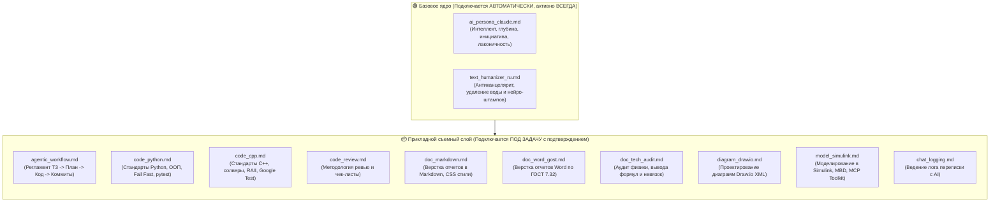
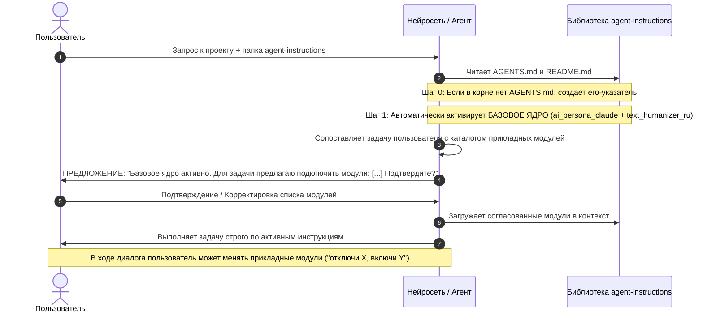

# Путеводитель по библиотеке системных инструкций (`agent-instructions`)

> **Концепция библиотеки:** Данная папка представляет собой универсальный «съемный диск» модульных системных промптов и навыков (скиллов) для любой нейросети (ChatGPT, Claude, Gemini, DeepSeek, Cursor, Antigravity IDE и др.). 
> Архитектура инструкций разделена на два уровня:
> 1. **Базовое ядро (Core Layer):** фундаментальные инструкции по манере мышления, инициативности и качеству русского языка — **подключаются автоматически и работают всегда**.
> 2. **Прикладной слой (Task Layer):** съемные инженерные модули под конкретные типы работ (Python, C++, Word/ГОСТ, Markdown, ревью и т.д.) — **подключаются по согласованию с пользователем под конкретную задачу**.

---

## 1. Двухуровневая архитектура инструкций

---

## 2. Обязательный протокол работы нейросети (Bootstrap Protocol)

Главной точкой входа является файл [`AGENTS.md`](AGENTS.md). Когда пользователь передает нейросети папку `agent-instructions/` или файл `AGENTS.md`, нейросеть обязана следовать протоколу:

### Шаг 0. Самоустановка загрузчика в корень (Self-Bootstrapping)
Если файл `AGENTS.md` в корне рабочего каталога отсутствует, агент автоматически создает его со ссылкой на `agent-instructions/AGENTS.md`. Если файл уже есть — не перезаписывает.

### Шаг 1. Безусловная активация базового ядра
Сразу при старте диалога нейросеть загружает:
- [`ai_persona_claude.md`](ai_persona_claude.md)
- [`text_humanizer_ru.md`](text_humanizer_ru.md)

Они определяют тон общения, глубину анализа и искоренение канцелярита во всех последующих ответах.

### Шаг 2. Запрос на согласование прикладных промптов (Монтирование)
**Перед началом любых действий (написания кода, отчетов или планов)** нейросеть обязана сопоставить запрос пользователя с каталогом и запросить подтверждение на монтирование прикладных модулей:

> ⚙️ **Инициализация системных инструкций:**  
> - 🟢 **Базовое ядро (подключено автоматически):** `ai_persona_claude.md`, `text_humanizer_ru.md`.  
> - 📦 **Предлагаемые прикладные модули под вашу задачу:**  
>   - `[x]` **`<имя_модуля_1.md>`** — `<краткое назначение>`  
>   - `[x]` **`<имя_модуля_2.md>`** — `<краткое назначение>`  
>  
> *Подтвердите подключение прикладных модулей или укажите, какие добавить/отключить.*

### Шаг 3. Удержание в фокусе внимания
После подтверждения пользователем выбранные модули действуют как **постоянные системные инструкции** на протяжении всего диалога. Нейросеть обязана сверяться с ними перед каждым действием.

### Шаг 4. Динамическое переключение («горячая замена»)
Пользователь может в любой момент изменить состав прикладных модулей (например: *«Подключи `doc_word_gost.md` и отключи `code_python.md` — переходим к верстке отчета по ГОСТ»*). Базовое ядро при этом продолжает действовать постоянно.

---

## 3. Каталог модулей библиотеки

### 🟢 Базовое постоянное ядро (Core Layer — активно всегда)

| Файл модуля | Назначение и сфера ответственности | Ключевые аспекты |
|---|---|---|
| [`ai_persona_claude.md`](ai_persona_claude.md) | **Академический стиль и персона Claude** | Сдержанный, академический и серьёзный тон общения. Глубокий интеллект, партнерский диалог без банальностей, заискиваний и восторгов. |
| [`text_humanizer_ru.md`](text_humanizer_ru.md) | **Редактура текста и антиканцелярит** | Искоренение канцелярита, воды и нейросетевых клише («это не просто..., а целый...»). Принцип «удаляй, не дописывай». Сохранение фактов и строгого научного регистра. |

---

### 📦 Прикладной съемный слой (Task Layer — подключается под задачу)

| Файл модуля | Назначение и сфера ответственности | Ключевые аспекты |
|---|---|---|
| [`agentic_workflow.md`](agentic_workflow.md) | **Регламент агентной разработки** | Полный цикл: ТЗ (`*_tz.md`) → План (`*_plan.md`) → Реализация → Тесты → Коммит этапа. Запрет слепой генерации кода. Относительные ссылки. Роли (Designer, Implementer, Reviewer) и дневники решений. |
| [`code_python.md`](code_python.md) | **Разработка и архитектура на Python** | Стандарты PEP 8/257, docstrings `"""`, `__all__`, аннотации типов, `__slots__`, Fail Fast (`kw_only=True`, валидация в `__post_init__`), DRY, ООП через `abc.ABC`, Юникод в комментариях, тестирование с `pytest` (AAA). |
| [`code_cpp.md`](code_cpp.md) | **Разработка и архитектура на C++** | Модель «Параметры → Решатель → Результат», RAII, designated initializers (C++20), Fail Fast с `NaN`, Doxygen в `.h`, запрет `using namespace std;`, численные солверы, Google Test (AAA). |
| [`code_review.md`](code_review.md) | **Методология и проведение код-ревью** | Проверка студенческих работ и Pull Request. Три режима: обучающий (наставнический), детальный аудит, production. Связка с универсальными чек-листами [`review_checklists/`](review_checklists/README.md). |
| [`doc_markdown.md`](doc_markdown.md) | **Оформление документов в Markdown** | Верстка отчетов, ТЗ и планов. Адаптивные стили (Dark/Light mode без жесткого `#000` + печать по ГОСТ), формулы LaTeX, таблицы, рисунки `figure/figcaption`, относительные ссылки. |
| [`doc_word_gost.md`](doc_word_gost.md) | **Оформление отчетов в Word по ГОСТ 7.32** | Полный стандарт ГОСТ 7.32-2017 и ГОСТ Р 7.0.5-2008 в `.docx` и PDF. Поля, шрифты, неразрывность блоков (`keepNext`, `cantSplit`, `tblHeader`), формулы OMML, автоматизация `python-docx` и Word COM. |
| [`doc_tech_audit.md`](doc_tech_audit.md) | **Рецензирование инженерного смысла и физики** | Проверка непрерывности математического вывода, физической адекватности допущений, законов сохранения, размерностей величин и масштабов невязок численных методов. |
| [`diagram_drawio.md`](diagram_drawio.md) | **Проектирование диаграмм Draw.io (XML)** | Создание и редактирование схем в формате валидного XML (`.drawio` / `*.drawio.svg`). Стабильные ID, контейнеры, стили, аккуратная маршрутизация связей без пересечений. |
| [`model_simulink.md`](model_simulink.md) | **Моделирование в Simulink и MBD** | Архитектура SATK/MCP, 9 инструментов, регламент `model_edit`, Guardrails (безопасные SID `Simulink.ID.getFullName`, автолейаут, защита от `StopTime=inf`), неразрушающая симуляция (`SimulationInput`), V&V тесты (Gherkin/`model_test`). |
| [`chat_logging.md`](chat_logging.md) | **Ведение лога диалога с AI** | Фиксация хода работы в `docs/<lab>/<chat>-chat-log.md`. Сквозная нумерация реплик, временные метки, защита от затирания чужих чатов, исключение служебных тегов. |

---

## 4. Матрица типовых прикладных сценариев

При выборе задачи к **Базовому ядру** (`ai_persona_claude.md` + `text_humanizer_ru.md`) подключаются:

- **Лабораторная работа на Python:** [`code_python.md`](code_python.md) + [`agentic_workflow.md`](agentic_workflow.md) + [`chat_logging.md`](chat_logging.md)
- **Лабораторная работа на C++:** [`code_cpp.md`](code_cpp.md) + [`agentic_workflow.md`](agentic_workflow.md) + [`chat_logging.md`](chat_logging.md)
- **Код-ревью и аудит решения:** [`code_review.md`](code_review.md) + целевой язык ([`code_python.md`](code_python.md) / [`code_cpp.md`](code_cpp.md)) + [`review_checklists/`](review_checklists/README.md)
- **Верстка отчета в Markdown:** [`doc_markdown.md`](doc_markdown.md) + [`doc_tech_audit.md`](doc_tech_audit.md)
- **Верстка отчета в Word по ГОСТ:** [`doc_word_gost.md`](doc_word_gost.md) + [`doc_tech_audit.md`](doc_tech_audit.md)
- **Схемы и архитектурные диаграммы:** [`diagram_drawio.md`](diagram_drawio.md) + [`doc_markdown.md`](doc_markdown.md)
- **Моделирование и системы управления в Simulink:** [`model_simulink.md`](model_simulink.md) + [`agentic_workflow.md`](agentic_workflow.md) + [`chat_logging.md`](chat_logging.md)
- **Комплексный проект (C++ солвер + Simulink S-Function/C-Caller):** [`code_cpp.md`](code_cpp.md) + [`model_simulink.md`](model_simulink.md) + [`doc_tech_audit.md`](doc_tech_audit.md)
