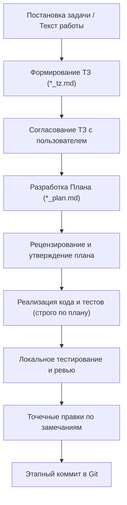

# Регламент агентной разработки: ТЗ, План, Реализация, Коммиты

Этот модуль задает обязательный рабочий процесс при выполнении лабораторных работ, курсовых и инженерных проектов в агентном режиме. 

Инструкция применима к любой нейросети и любому проекту. Она регулирует переход от неполной постановки задачи к проверенному коду с сохранением прозрачной истории разработки.

> 🛑 **ЭКСПРЕСС-ИНВАРИАНТЫ WORKFLOW (GUARDRAILS TOP-5 ДЛЯ НЕЙРОСЕТИ):**
> 1. **Шлагбаум согласования (Anti-bundling Gate):** Категорически запрещено генерировать ТЗ и План одновременно в одной реплике! Сначала только ТЗ (`*_tz.md`) → ожидание подтверждения пользователя → затем План (`*_plan.md`) → ожидание подтверждения → только после этого реализация кода.
> 2. **Запрет слепой генерации:** Не писать код до утверждения Плана. Не добавлять сущности, методы и библиотеки «про запас».
> 3. **Только относительные ссылки:** Вся документация оформляется только относительными путями от корня (`[src/solver.py](src/solver.py)`). Абсолютные пути (`C:\...`, `/home/...`) и `file://` категорически запрещены.
> 4. **Неприкосновенность тестов:** Если тест упал — причину устраняют в коде реализации, а не подгоняют assert.
> 5. **Этапные коммиты:** Каждый этап фиксируется отдельным коммитом с чистой историей без бинарников и временных файлов.

---

## 1. Базовый цикл этапа разработки

Каждый этап проекта или лабораторной работы строго следует контуру:

$$\text{ТЗ } (*\_tz.md) \longrightarrow \text{План } (*\_plan.md) \longrightarrow \text{Реализация и тесты} \longrightarrow \text{Промежуточный коммит}$$

Переход к следующему шагу разрешен только после согласования и фиксации предыдущего.

### 1.1. Жесткий барьер согласования (Anti-bundling Gate)

Категорически запрещено объединять шаги и генерировать ТЗ и План одновременно в рамках одной реплики или одного действия агента.

Действует строго последовательный регламент с обязательными точками останова (Gates):
1. **Этап формирования ТЗ (с обязательным запросом лекций):** 
   - **Запрос лекционного материала:** Перед началом формирования ТЗ агент **ОБЯЗАН запросить у пользователя ссылку на лекционный материал** (или проверить наличие файлов лекций в рабочем пространстве). Формировать ТЗ без опоры на лекционный курс категорически запрещено!
   - **Строгие лекционные обозначения:** Все математические и физические обозначения, переменные, верхние/нижние индексы и термины в ТЗ обязаны формулироваться **строго на русском языке точь-в-точь как в лекционном курсе** (например, $P_i^0(T)$ вместо англоязычного $P_i^{sat}$, коэффициенты фазового равновесия $k_i$ вместо «K-values» / $K_i$).
   - Агент формирует **исключительно** файл ТЗ (`*_tz.md`) и останавливает диалог, запрашивая рецензию пользователя. До утверждения ТЗ агенту **строго запрещено** создавать, наполнять или предлагать файл Плана (`*_plan.md`).
2. **Точка останова (Рецензирование ТЗ):** Пользователь изучает ТЗ, вносит необходимые правки и дает прямое подтверждение («ТЗ принимаю» / «согласен с ТЗ»).
3. **Этап формирования Плана:** Только после явного утверждения ТЗ пользователем агент формирует файл Плана (`*_plan.md`) и вновь останавливает диалог для согласования шагов декомпозиции, списка затронутых файлов и тестов.
4. **Точка останова (Рецензирование Плана):** Пользователь проверяет и утверждает План («План принимаю» / «согласен с планом»).
5. **Старт реализации:** Любые действия с кодом, модификацией расчетных моделей, запуском симуляций и оформлением отчетов разрешены **исключительно после утверждения Плана**.

---

## 2. Формирование ТЗ (`*_tz.md`)

ТЗ составляется в файле с говорящим названием вида `<имя_этапа>_tz.md` в папке документации (например, `docs/<lab>/<stage>_tz.md`).

### Требования к содержанию ТЗ:
1. **Синхронизация с лекциями и кафедральная номенклатура:**
   - Перед составлением ТЗ агент обязан запросить у пользователя ссылку на лекционный материал или проверить локальные файлы лекций.
   - Все формулы, символы величин, индексы и русскоязычные термины берутся строго из лекций (запрещено использовать англоязычные аналоги или обозначения «по памяти», если в курсе принята кафедральная номенклатура).
2. **Закрытие когнитивного долга:** текст лабораторной работы часто намеренно неполон или содержит умолчания. В ТЗ формулируются четкие математические, физические и алгоритмические требования.
3. **Формулы в нотации $\TeX$:** все математические выражения, расчетные соотношения и диапазоны записываются через формулы TeX/LaTeX (например, $\$Q = \mu S \sqrt{2g\Delta H}\$).
4. **Границы скоупа («Что делаем» и «Что НЕ трогаем»):**
   - Четко фиксируется список разрабатываемых сущностей.
   - Явно указывается, какие файлы, модули и архитектурные решения затрагивать **запрещено**.
5. **Контракты и обработка исключений:** описываются условия выброса ошибок, типы исключений и текст сообщений.
6. **Тестирование бизнес-логики:** ТЗ обязано содержать критерии проверки с характерными расчетными примерами и граничными случаями (ноль, обратный ток, невозможные значения, точность сходимости).
7. **Открытые вопросы:** пункты «на подумать» или неоднозначности оформляются в секцию открытых вопросов и согласовываются с пользователем **до** написания кода.

---

## 3. Формирование Плана (`*_plan.md`)

План фиксируется в файле `<имя_этапа>_plan.md` рядом с ТЗ.

### Обязательные разделы плана:
1. **Точный список модифицируемых и создаваемых файлов:**
   - Пути указываются относительно корня репозитория (например, `src/solver.py`, `tests/test_solver.py`).
   - Изменять файлы, не включенные в утвержденный план, запрещено.
2. **Анализ дублирования (DRY):** как новое поведение стыкуется с существующим кодом? Какие общие функции/классы переиспользуются, чтобы исключить копирование логики?
3. **План декомпозиции и реализации:** пошаговая последовательность внесения правок:
   - Объявление типов данных и структур параметров;
   - Реализация расчетных ядер/алгоритмов;
   - Подключение во внешние интерфейсы;
   - Интеграция в сборочные скрипты (`CMakeLists.txt`, `requirements.txt`).
4. **План тестирования:**
   - Ключевые тесты бизнес-логики (физическая адекватность, эталонные примеры);
   - Технические тесты (граничные условия, валидация входных данных, Fail Fast).

---

## 4. Реализация кода и ограничения

1. **Запрет слепой генерации целиком:** категорически запрещено генерировать код больших файлов «вслепую» во внешних чатах (ChatGPT, DeepSeek и др.) без погружения в архитектуру и утверждения плана.
2. **Реализация строго по ТЗ:**
   - Не добавлять методы, типы, флаги и обобщения «на будущее», если они не запрошены ТЗ.
   - Не рефакторить соседний код «заодно».
   - Если в чужом коде замечен дефект — зафиксировать его в списке замечаний, но не исправлять без указания пользователя.
3. **Принцип минимального изменения:** вносить минимально достаточные правки для решения задачи этапа.
4. **Точечные правки после ревью:** если код после первого прогона в целом корректен, вносить только прицельные правки в проблемные места, не переписывая файл с нуля.
5. **Неприкосновенность упавших тестов:** при падении тестов категорически запрещено изменять сам тест ради его формального прохождения. Дефект локализуется и устраняется в коде реализации. Любое изменение тестов при вынужденных архитектурных решениях согласуется с пользователем в обязательном порядке.

---

## 5. Правила оформления ссылок в документации

В любых `.md` документах (ТЗ, планы, отчеты, дневники):

1. **Только относительные пути от корня проекта:**
   - Правильно: `[src/solver.py](src/solver.py)`, `[docs/lab3/stage1_tz.md](docs/lab3/stage1_tz.md)`.
   - Обоснование: относительные пути поддерживают мгновенный переход по клику (Ctrl+Click) в VS Code / Antigravity IDE / Cursor и сохраняют работоспособность при клонировании репозитория.
2. **Категорический запрет абсолютных путей:**
   - Запрещено: `file:///C:/Users/.../src/solver.py`
   - Запрещено: `C:\Users\ernst\...\src\solver.py`
   - Запрещено: `/home/user/.../src/solver.py`
   Абсолютные пути привязаны к конкретной файловой системе и ломаются при переносе проекта на другой компьютер или при проверке преподавателем.

---

## 6. Требования к этапным коммитам в Git

История коммитов в репозитории должна документировать последовательное выполнение работы по этапам. Преподаватель может откатить репозиторий на любой этап для проверки самостоятельности выполнения.

1. **Отдельный коммит на каждый этап:** после завершения и тестирования каждого этапа выполняется коммит. Пропуск промежуточного коммита — основание для непринятия работы.
2. **Именование коммита:** имя коммита должно соответствовать названию этапа (например, `1_basic`, `2_criteria`, `3_exceptions`).
3. **Состав этапного коммита:** в коммит обязаны входить:
   - Файл ТЗ: `<имя_этапа>_tz.md`;
   - Файл Плана: `<имя_этапа>_plan.md`;
   - Реализация исходного кода этапа;
   - Набор тестов этапа;
   - Обновленные конфигурации сборки (`CMakeLists.txt`, `requirements.txt`).
4. **Чистота коммита:** в коммит не должны попадать бинарные файлы сборки, кэши, виртуальные окружения и временные дампы.

---

## 7. Ролевая модель и передача контекста (Дневники решений)

При сложной командной или агентной разработке процесс разделяется на 3 роли:

| Роль | Основная задача | Ограничения |
|---|---|---|
| **Designer** (Архитектор/Аналитик) | Анализ ТЗ, выявление граничных случаев, проработка математики, выбор архитектурных вариантов | **Не пишет код реализации**, не утверждает спорную архитектуру без согласования с пользователем |
| **Implementer** (Исполнитель) | Реализация кода и тестов строго по ТЗ и утвержденному плану | Не меняет архитектуру и API самостоятельно; при неясности в ТЗ останавливается и задает вопрос |
| **Reviewer** (Рецензент) | Статический анализ, проверка соответствия ТЗ, регламентам стиля, оптимальности и надежности | **Не правит код самостоятельно**; выдает структурированные замечания по уровням критичности |

### Фиксация контекста через файлы (вместо потери в чате):
- `decisions.md` — журнал принятых архитектурных решений (D-001, обоснование, альтернативы).
- `questions.md` — журнал блокирующих вопросов и полученных ответов.
- `progress.md` — текущий статус шагов, затронутые файлы, обнаруженный проблемный сторонний код.
- `review_notes.md` — журнал замечаний рецензента (файл, строка, приоритет, статус устранения).
