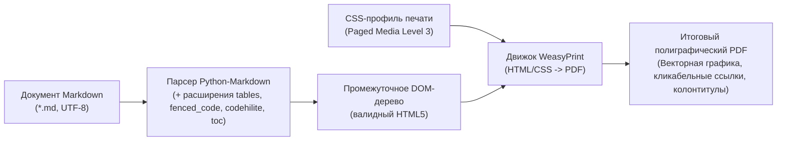
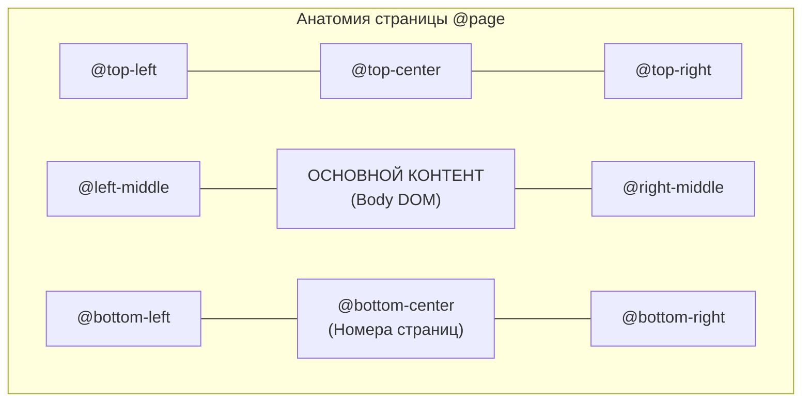

# Конвертация Markdown в PDF (CSS Paged Media, WeasyPrint)

Этот модуль регламентирует архитектуру, инструментарий, стилизацию и процедуру автоматической компиляции технической документации и отчетов из формата Markdown (`.md`) в полиграфический PDF (`.pdf`).

Инструкция действует как прикладной инженерный стандарт для нейросетей и разработчиков при создании скриптов сборки, автоматизации экспорта отчетов по лабораторным работам, ТЗ, планов и архитектурных описаний без использования офисных пакетов и ручного управления браузером.

---

## 1. Архитектурный пайплайн и обоснование стека

### 1.1 Схема преобразования



### 1.2 Обоснование выбора WeasyPrint перед альтернативами

| Критерий | WeasyPrint (выбранный стек) | Headless Chrome / Puppeteer | wkhtmltopdf (устаревший) | Pandoc + LaTeX |
|---|---|---|---|---|
| **Поддержка CSS Paged Media** | Полная (спецификация W3C: `@page`, маргинальные боксы, счетчики) | Частичная (ограниченные колонтитулы, сложный контроль страниц) | Устаревший движок WebKit, масса артефактов верстки | Нет (требует написания шаблонов на LaTeX) |
| **Ресурсоемкость** | Минимальная (легковесный Python-пакет) | Высокая (требует бинарный Chromium > 200 МБ) | Низкая, но проект заброшен | Огромная (дистрибутив TeX Live > 4 ГБ) |
| **Контроль пагинации** | `break-inside: avoid;`, повтор `thead` на каждой странице | Часто ломает строки таблиц и блоки кода | Частые сбои пагинации | Полный контроль, но крутая кривая обучения |
| **Автономность в CLI / CI** | Запуск в одну команду через `uv` без инсталляции окружения | Требует драйверы браузера и зависимости X11/sandbox | Требует устаревшие системные библиотеки | Требует TeX-компилятор в системе |

---

## 2. Способы запуска и окружение

### 2.1 Изолированный запуск через `uv` (Рекомендуемый способ)
Утилита `uv` позволяет запускать конвертер без предварительной ручной установки зависимостей в системный Python:

```bash
uv run --with markdown --with weasyprint --with pygments python convert.py input.md -o dist/
```

Пакетная обработка группы файлов:
```bash
uv run --with markdown --with weasyprint --with pygments python convert.py docs/*.md -o pdf_out/ --css custom_style.css
```

### 2.2 Стандартный запуск через виртуальное окружение Python
При интеграции в существующий проект или виртуальное окружение:

```bash
# Установка зависимостей
pip install markdown weasyprint pygments

# Запуск конвертации
python convert.py report.md -o build/
```

> [!NOTE]
> **Особенности работы WeasyPrint на Windows:**
> WeasyPrint использует библиотеки Pango, HarfBuzz и cairo для растеризации шрифтов и отрисовки векторной графики. Современные версии WeasyPrint (начиная с версии 60+) содержат необходимые бинарные зависимости в колёсах (wheels) для Windows. При возникновении ошибки загрузки библиотек DLL необходимо установить GTK3 для Windows или воспользоваться запуском внутри WSL2 / контейнера.

---

## 3. Эталонный скрипт конвертации (`convert.py`)

Скрипт полностью автономен, строго следует стандартам [`code_python.md`](code_python.md), содержит аннотации типов, обработку относительных путей, подсветку синтаксиса кода и внедрение стилей.

```python
"""Универсальный конвертер Markdown-документов в PDF с поддержкой CSS Paged Media.

Модуль выполняет парсинг Markdown с расширениями (таблицы, листинги, подсветка кода)
и последующий рендеринг в PDF через движок WeasyPrint.
"""

from __future__ import annotations

import argparse
import logging
import sys
from pathlib import Path
from typing import Sequence

import markdown
from weasyprint import CSS, HTML

__all__: list[str] = ["convert_markdown_to_pdf", "build_html_document"]

logging.basicConfig(level=logging.INFO, format="%(levelname)s: %(message)s")
logger = logging.getLogger(__name__)

# Базовые встроенные стили печати (CSS Paged Media Level 3)
DEFAULT_CSS_CONTENT = """
@page {
    size: A4;
    margin: 20mm 15mm 20mm 20mm;
    @bottom-center {
        content: counter(page) " / " counter(pages);
        font-family: -apple-system, BlinkMacSystemFont, "Segoe UI", Roboto, "Helvetica Neue", Arial, sans-serif;
        font-size: 9pt;
        color: #666;
    }
}

@page :first {
    @bottom-center {
        content: none;
    }
}

html, body {
    font-family: -apple-system, BlinkMacSystemFont, "Segoe UI", Roboto, "Helvetica Neue", Arial, sans-serif;
    font-size: 11pt;
    line-height: 1.6;
    color: #24292e;
    background-color: #fff;
    margin: 0;
    padding: 0;
}

h1, h2, h3, h4, h5, h6 {
    color: #111;
    font-weight: 600;
    margin-top: 1.4em;
    margin-bottom: 0.6em;
    break-after: avoid;
    page-break-after: avoid;
}

h1 { font-size: 20pt; border-bottom: 1px solid #eaecef; padding-bottom: 0.3em; }
h2 { font-size: 16pt; border-bottom: 1px solid #eaecef; padding-bottom: 0.2em; }
h3 { font-size: 13pt; }
h4 { font-size: 11pt; }

p {
    margin: 0 0 0.8em 0;
    text-align: justify;
    orphans: 2;
    widows: 2;
}

a {
    color: #0366d6;
    text-decoration: none;
}

hr {
    border: 0;
    height: 1px;
    background: #e1e4e8;
    margin: 2em 0;
    break-after: page;
    page-break-after: always;
}

/* Листинги кода */
pre {
    background-color: #f6f8fa;
    border-radius: 4px;
    padding: 12px;
    overflow-x: auto;
    font-family: "SFMono-Regular", Consolas, "Liberation Mono", Menlo, Courier, monospace;
    font-size: 9.5pt;
    line-height: 1.45;
    break-inside: avoid;
    page-break-inside: avoid;
    border: 1px solid #e1e4e8;
    white-space: pre-wrap;
    word-break: break-all;
}

code {
    font-family: "SFMono-Regular", Consolas, "Liberation Mono", Menlo, Courier, monospace;
    font-size: 0.9em;
    background-color: rgba(27, 31, 35, 0.05);
    padding: 0.2em 0.4em;
    border-radius: 3px;
}

pre code {
    background-color: transparent;
    padding: 0;
    font-size: 1em;
}

/* Таблицы */
table {
    border-collapse: collapse;
    width: 100%;
    margin: 1.2em 0;
    break-inside: auto;
    page-break-inside: auto;
    font-size: 10pt;
}

thead {
    display: table-header-group; /* Дублирует шапку таблицы при переносе на новую страницу */
}

tr {
    break-inside: avoid;
    page-break-inside: avoid;
}

th, td {
    border: 1px solid #dfe2e5;
    padding: 6px 12px;
    text-align: left;
}

th {
    background-color: #f6f8fa;
    font-weight: 600;
}

/* Изображения и плавающие блоки */
figure, img {
    max-width: 100%;
    height: auto;
    break-inside: avoid;
    page-break-inside: avoid;
}

figure {
    margin: 1.5em 0;
    text-align: center;
}

figcaption {
    font-size: 9pt;
    color: #555;
    margin-top: 0.5em;
}

blockquote {
    border-left: 4px solid #dfe2e5;
    color: #6a737d;
    padding: 0 1em;
    margin: 0 0 1em 0;
}
"""


def build_html_document(body_html: str, custom_css: str | None = None) -> str:
    """Оборачивает отрендеренный фрагмент Markdown в полноценный HTML5 документ.

    Args:
        body_html: Сгенерированное тело документа из Markdown.
        custom_css: Опциональные пользовательские CSS-стили.

    Returns:
        Сформированная HTML-страница со всеми стилями в секции head.
    """
    css_bundle = DEFAULT_CSS_CONTENT
    if custom_css:
        css_bundle += f"\n/* --- Custom Injected Styles --- */\n{custom_css}"

    return f"""<!DOCTYPE html>
<html lang="ru">
<head>
    <meta charset="utf-8">
    <title>Markdown to PDF Export</title>
    <style>
{css_bundle}
    </style>
</head>
<body>
{body_html}
</body>
</html>
"""


def convert_markdown_to_pdf(
    input_file: Path,
    output_file: Path,
    custom_css_path: Path | None = None,
) -> None:
    """Выполняет конвертацию одного файла Markdown в PDF.

    Args:
        input_file: Путь к исходному файлу .md (UTF-8).
        output_file: Путь для сохранения итогового файла .pdf.
        custom_css_path: Опциональный путь к файлу дополнительных CSS стилей.

    Raises:
        FileNotFoundError: Если исходный файл или указанный CSS не найдены.
        ValueError: Если исходный файл имеет недопустимое расширение или пуст.
    """
    if not input_file.exists():
        msg = f"Исходный файл не найден: {input_file}"
        raise FileNotFoundError(msg)

    if input_file.suffix.lower() not in {".md", ".markdown"}:
        msg = f"Ожидается файл Markdown (.md), получено: {input_file.name}"
        raise ValueError(msg)

    md_content = input_file.read_text(encoding="utf-8")
    if not md_content.strip():
        msg = f"Исходный файл пуст: {input_file}"
        raise ValueError(msg)

    custom_css: str | None = None
    if custom_css_path is not None:
        if not custom_css_path.exists():
            msg = f"Файл стилей не найден: {custom_css_path}"
            raise FileNotFoundError(msg)
        custom_css = custom_css_path.read_text(encoding="utf-8")

    # Инициализация парсера Markdown с необходимыми расширениями
    md_extensions = [
        "tables",
        "fenced_code",
        "codehilite",
        "toc",
        "def_list",
        "attr_list",
    ]
    extension_configs = {
        "codehilite": {
            "guess_lang": False,
            "noclasses": True,  # Инлайновые стили для цветов подсветки кода
            "pygments_style": "default",
        },
    }

    body_html = markdown.markdown(
        md_content,
        extensions=md_extensions,
        extension_configs=extension_configs,
    )

    full_html = build_html_document(body_html=body_html, custom_css=custom_css)

    output_file.parent.mkdir(parents=True, exist_ok=True)

    # base_url задается каталогом исходного файла для корректного поиска локальных картинок
    base_dir = str(input_file.parent.resolve())
    html_renderer = HTML(string=full_html, base_url=base_dir)
    html_renderer.write_pdf(target=str(output_file))

    logger.info("Успешно создан PDF: %s -> %s", input_file.name, output_file)


def main(argv: Sequence[str] | None = None) -> int:
    """Точка входа командной строки."""
    parser = argparse.ArgumentParser(
        description="Конвертация Markdown в PDF с поддержкой CSS Paged Media (WeasyPrint).",
    )
    parser.add_argument(
        "inputs",
        nargs="+",
        type=Path,
        help="Один или несколько файлов Markdown (.md) для конвертации",
    )
    parser.add_argument(
        "-o",
        "--output-dir",
        type=Path,
        default=None,
        help="Каталог сохранения сгенерированных PDF (по умолчанию — рядом с исходником)",
    )
    parser.add_argument(
        "--css",
        type=Path,
        default=None,
        help="Путь к внешнему CSS-файлу для переопределения правил верстки",
    )

    args = parser.parse_args(argv)

    success_count = 0
    failure_count = 0

    for input_path in args.inputs:
        try:
            if args.output_dir:
                dest_file = args.output_dir / f"{input_path.stem}.pdf"
            else:
                dest_file = input_path.with_suffix(".pdf")

            convert_markdown_to_pdf(
                input_file=input_path,
                output_file=dest_file,
                custom_css_path=args.css,
            )
            success_count += 1
        except Exception as err:  # noqa: BLE001
            logger.error("Ошибка при обработке %s: %s", input_path, err)
            failure_count += 1

    logger.info("Конвертация завершена. Успешно: %d, с ошибками: %d", success_count, failure_count)
    return 1 if failure_count > 0 else 0


if __name__ == "__main__":
    sys.exit(main())
```

---

## 4. Специфика верстки CSS Paged Media

### 4.1 Контроль разрывов страниц (Page Break Control)

WeasyPrint строго поддерживает свойства `break-inside`, `break-before` и `break-after` из спецификации CSS Paged Media Level 3:

```css
/* 1. Запрет отрыва заголовка от следующего за ним текста (Orphan Heading) */
h1, h2, h3, h4, h5, h6 {
    break-after: avoid;
    page-break-after: avoid;
}

/* 2. Запрет разрыва листинга кода или рисунка посередине блока */
pre, figure, .card, .callout {
    break-inside: avoid;
    page-break-inside: avoid;
}

/* 3. Принудительный перенос раздела на новую страницу */
.page-break, hr {
    break-after: page;
    page-break-after: always;
}

/* 4. Разрешение переноса длинных таблиц с сохранением шапки */
table {
    break-inside: auto;
}
thead {
    display: table-header-group; /* Повторяется вверху каждой страницы при переносе */
}
tr {
    break-inside: avoid; /* Запрещает разрыв отдельной строки таблицы пополам */
}
```

### 4.2 Маргинальные боксы страницы (`@page`)

CSS Paged Media делит область полей страницы на 16 маргинальных боксов:



Пример настройки колонтитулов и номеров страниц:
```css
@page {
    size: A4 portrait;
    margin: 20mm 15mm 20mm 20mm;

    @top-right {
        content: "Лабораторная работа №3";
        font-size: 8pt;
        color: #888;
    }

    @bottom-center {
        content: "Страница " counter(page) " из " counter(pages);
        font-size: 9pt;
    }
}

/* Титульный лист (первая страница) без колонтитулов */
@page :first {
    @top-right { content: none; }
    @bottom-center { content: none; }
}
```

---

## 5. Профили стилизации: Современный и ГОСТ 7.32

### 5.1 Профиль: Академический ГОСТ 7.32 (`gost_style.css`)
Используется для оформления лабораторных работ, пояснительных записок и курсовых проектов в связке с модулями [`doc_markdown.md`](doc_markdown.md) и [`doc_word_gost.md`](doc_word_gost.md).

```css
@page {
    size: A4 portrait;
    /* Поля по ГОСТ 7.32: левое 30 мм, правое 15 мм, верхнее 20 мм, нижнее 20 мм */
    margin: 20mm 15mm 20mm 30mm;

    @bottom-center {
        content: counter(page);
        font-family: "Times New Roman", Times, serif;
        font-size: 11pt;
        color: #000;
    }
}

@page :first {
    @bottom-center { content: none; }
}

html, body {
    font-family: "Times New Roman", Times, serif;
    font-size: 14pt;
    line-height: 1.5;
    color: #000;
    background-color: #fff;
}

/* Абзацы с красной строкой 1.25 см */
p {
    text-align: justify;
    text-indent: 1.25cm;
    margin: 0 0 0.4em 0;
    orphans: 2;
    widows: 2;
}

/* Заголовки по ГОСТ */
h1, h2, h3 {
    font-family: "Times New Roman", Times, serif;
    font-weight: bold;
    color: #000;
    text-align: center;
    text-indent: 0;
    break-after: avoid;
    page-break-after: avoid;
}

h1 { font-size: 14pt; text-transform: uppercase; margin-top: 1.5em; margin-bottom: 0.8em; }
h2 { font-size: 14pt; margin-top: 1.2em; margin-bottom: 0.6em; }
h3 { font-size: 14pt; margin-top: 1.0em; margin-bottom: 0.4em; }

/* Таблицы по ГОСТ: сплошные черные границы */
table {
    border-collapse: collapse;
    width: 100%;
    margin: 1.2em 0;
    font-size: 12pt;
    line-height: 1.2;
}

th, td {
    border: 1px solid #000;
    padding: 5px 8px;
    text-align: left;
}

th {
    font-weight: bold;
    text-align: center;
    background-color: transparent;
}
```

### 5.2 Профиль: Современный инженерный отчет (`modern_clean.css`)
Используется для архитектурных документов, технических аудитов ([`doc_tech_audit.md`](doc_tech_audit.md)), регламентов и ТЗ. Характеризуется строгой неогротескной типографикой (Inter / Segoe UI), легкими фоновыми плашками листингов и акцентными цветовыми блоками.

---

## 6. Обработка графики и формул

### 6.1 Векторные схемы Draw.io (`*.drawio.svg`)
WeasyPrint нативно парсит формат SVG без растрирования. Диаграммы, экспортированные по правилам [`diagram_drawio.md`](diagram_drawio.md), сохраняют идеальную векторную резкость при любом увеличении PDF:

```markdown
<figure>
  
  <figcaption>Рисунок 1 — Структурная схема вычислительного контура</figcaption>
</figure>
```

> [!IMPORTANT]
> **Разрешение путей к ассетам (Base URL):**
> Для того чтобы локальные изображения корректно попадали в итоговый PDF, в функцию `HTML(..., base_url=...)` всегда передается абсолютный путь к каталогу исходного Markdown-файла. В самом Markdown пути указываются относительно этого файла.

### 6.2 Математические формулы LaTeX
Сам парсер Python-Markdown не компилирует формулы `$E = mc^2$`. Для их отображения в PDF применяются два инженерных подхода:

1. **Предварительный рендеринг в SVG:** формулы компилируются в автономные SVG-файлы и подключаются стандартным тегом ``.
2. **Расширение `markdown-katex`:**
   ```bash
   pip install markdown-katex
   ```
   В скрипте `convert.py` добавляется расширение `"katex"`, которое подставляет скомпилированный MathML/HTML, поддерживаемый WeasyPrint.

---

## 7. Чек-лист проверки и верификации готового PDF

Перед передачей сгенерированного документа пользователю или прикреплением к отчету агент выполняет проверку:

- [ ] **Отсутствие оторванных заголовков (Heading Orphans):** ни один заголовок `h1`-`h4` не находится внизу страницы без минимум двух строк последующего текста.
- [ ] **Целостность шапок таблиц:** таблицы, разрывающиеся на несколько страниц, имеют повторяющуюся строку заголовка (`thead`) в начале каждого нового листа.
- [ ] **Неразрывность строк таблиц:** ни одна строка таблицы (`tr`) не расщеплена пополам между страницами.
- [ ] **Форматирование листингов кода:** длинные строки кода оборачиваются (`white-space: pre-wrap;`), блоки `pre` не обрезаются по правому краю поля страницы.
- [ ] **Нумерация страниц:** титульный лист не содержит номера; страницы пронумерованы сквозным счетчиком формата `N` или `N / M`.
- [ ] **Векторная графика:** диаграммы SVG отмасштабированы по ширине полосы набора (`max-width: 100%`) и сохраняют векторную резкость при 400% зуме.
- [ ] **Шрифты и Юникод:** все кириллические символы отображаются корректным начертанием (нет артефактов ненайденных глифов или замены шрифта на дефолтный monospace).
