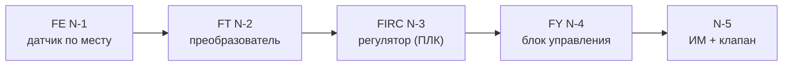

# Правила оформления ФСА (ГОСТ 21.208-2013, ГОСТ 21.408-2013)

24.09.2026 · Nikita

## 1. Назначение и нормативная база

ФСА по фото или эскизу перерисовывается развёрнутым способом: каждый контур целиком на технологической части, функции контуров — в подвале. Правила ниже — это ГОСТ плюс требования преподавателя (кафедра АТП); при расхождении действуют требования преподавателя.

| Документ | Что из него берём |
| --- | --- |
| ГОСТ 21.208-2013 | Условные обозначения приборов, буквенные коды, размеры символов (заменил ГОСТ 21.404-85) |
| ГОСТ 21.408-2013 | Правила выполнения схемы автоматизации: разрывы линий, номера, таблица контуров |
| ГОСТ 2.104, ГОСТ 21.101 | Рамка и основная надпись (форма 1) |
| ГОСТ 2.303 | Типы и толщины линий |
| ГОСТ 2.782, 2.785, 2.789, 2.790 | Насосы, арматура, теплообменники, колонны |

## 2. Порядок работы по фото или рисунку

Сначала исходник разбирается в таблицу (оборудование, потоки, контуры), и только потом рисуется схема.

1. Выписать оборудование с позициями и назначением: Н — насос, Т — теплообменник, К — колонна, КХ — конденсатор-холодильник, Е — ёмкость, И — испаритель.
2. Проследить каждую трубу: откуда и куда идёт, как подписаны внешние входы и выходы (Сырьё, Пар, Газ, Продукт).
3. Каждый кружок FC, TC, PC, LC на эскизе — это контур. Для него записать: где линия касается трубы или аппарата (место отбора) и какой клапан он двигает.
4. Линия к ИМ без кружка — контур без обозначения; уточнить у преподавателя (обычно это уровень LC в кубе колонны).
5. Места замеров — строго по эскизу: до или после насоса, на какой именно трубе. Трубопроводы и отводы, которых нет на эскизе, не дорисовывать.
6. Составить таблицу контуров: №, параметр, место отбора, регулирующий клапан, функции.
7. Рисовать в порядке: технология → контуры → выносные линии → подвал → таблица контуров, условные обозначения, штамп → чек-лист (раздел 12).

Пример ошибки из практики: расход дистиллята FE 7-1 был поставлен после насоса, а по эскизу он до насоса (на всасе).

## 3. Лист, рамка и компоновка

Лист — А3 альбомный 420×297 мм: технология с контурами сверху, подвал под ней, внизу таблица контуров, условные обозначения и штамп.

- Рамка: поле слева 20 мм, с остальных сторон 5 мм.
- Основная надпись 185×55 мм — в правом нижнем углу; дополнительная графа 70×14 мм — в левом верхнем.
- Рамка и штамп — на фоновой странице, схема — на основной.
- Оборудование располагается слева направо по ходу процесса, контуры — рядом со своими аппаратами.

| Зона | Положение на листе, мм (от левого нижнего угла) |
| --- | --- |
| Технология с контурами | y ≈ 133…290 |
| Номера над подвалом | y ≈ 127 |
| Подвал | x 25…410, y 62…124 |
| Таблица контуров | x 25…157, y 10…58 |
| Условные обозначения | x 162…228, y 10…58 |
| Основная надпись | x 230…415, y 5…60 |

## 4. Технологическое оборудование и трубопроводы

Оборудование рисуется упрощённо, основной линией 1,5 пт, с позицией внутри или рядом (Н-1, Т-2, К-3, КХ-4, Е-5, Н-6, И-7).

| Оборудование | Изображение | Размер, мм |
| --- | --- | --- |
| Колонна | Обечайка с эллиптическими днищами | 20 × 90…110 |
| Теплообменник, конденсатор-холодильник | Круг с зигзагом теплоносителя; вход снизу слева, выход сверху справа | Ø16 |
| Насос центробежный | Круг с тангенциальным нагнетательным патрубком; всас сбоку | Ø12 |
| Ёмкость горизонтальная | Прямоугольник с эллиптическими днищами | 45 × 16 |
| Испаритель (кипятильник) | Прямоугольник с трубным пучком | 26 × 12 |

- Трубопровод — сплошная 1,5 пт; стрелка потока — у входа в аппарат и на выходах из схемы.
- Внешние потоки подписываются у начала или конца линии: «Сырьё (СН)», «Теплоноситель», «Хладагент», «Пар», «Газ», «Дистиллят», «Кубовый продукт».
- Регулирующий клапан и расходомерный датчик FE ставятся в разрыв трубы.
- Разветвление трубы отмечается точкой.
- Уточнение 26.09.2026 (quizyforu-eng): теплообменник и холодильник рисуются «молнией» — теплоноситель по диагонали 45° с горизонтальным изломом в центре круга, продолжается за кругом (мастер трафарета обновлён). Подробности — `reference-sheet.md`, п. 9.

## 5. Состав контура и нумерация позиций

Каждый контур рисуется целиком на технологической части по ходу сигнала; позиция — N-k, где N — номер контура, k — номер элемента.

Цепочка для расхода; для других параметров — в таблице.

| Параметр | Цепочка | Позиции |
| --- | --- | --- |
| Расход | FE → FT → FIRC → FY → ИМ | N-1…N-5 |
| Температура | TE → TIRC → TY → ИМ (без TT, как у преподавателя) | N-1…N-4 |
| Давление | PE → PT → PIRC → PY → ИМ | N-1…N-5 |
| Уровень | LE → LT → LIRC → LY → ИМ | N-1…N-5 |

- Контуры нумеруются 1, 2, 3… по ходу процесса слева направо; клапан с ИМ — последний номер контура.
- Датчик xE ставится в разрыв трубы (FE) или рядом с трубой или аппаратом с линией отбора (TE, PE, LE).
- Преобразователь xT — рядом с датчиком; блок управления xY — над (или под) ИМ; регулятор — между ними, контур образует «П» над или под трубой.
- ИМ в задании электрические, поэтому xY — блок управления ИМ, без подписи «I/P».
- Уточнение 26.09.2026 (quizyforu-eng):
  - если привод пневматический, ИМ рисуется квадратом 5×5 мм, у xY ставится «E/P»;
  - регулятор можно показывать в контуре, в подвале или в обоих местах — по заполненности листа (`reference-sheet.md`, п. 2–3).

## 6. Буквенные обозначения

Первая буква — измеряемая величина, далее функции в порядке I, R, C, A, S (как у преподавателя: FRCAS, TICA); указываются только функции, которые есть в подвале.

| Буква | На первом месте (величина) | На последующих местах (функция) |
| --- | --- | --- |
| F | Расход | — |
| T | Температура | Преобразователь (дистанционная передача) |
| P | Давление, вакуум | — |
| L | Уровень | Нижний предел (справа от прибора) |
| H | Ручное воздействие | Верхний предел (справа от прибора) |
| E | Напряжение | Чувствительный элемент (датчик) |
| Y | Событие, состояние | Вспомогательное устройство (блок управления ИМ) |
| I | Ток | Показание (индикация) |
| R | Радиоактивность | Регистрация |
| C | — | Автоматическое регулирование |
| A | Анализ (состав, концентрация) | Сигнализация |
| S | Скорость, частота | Включение, отключение, блокировка |

- Примеры: FIRCA — расход: показание, регистрация, регулирование, сигнализация; PIRCAS — то же для давления плюс блокировка.
- Для приборов с сигнализацией справа пишутся H и (или) L — какой предел контролируется.
- После смены букв регулятора надо поправить и точки в подвале, и таблицу контуров.

## 7. Графические обозначения и размеры

Прибор — круг Ø10 мм: датчики xE (по месту) — без черты; xT, xY и регуляторы (на щите) — с горизонтальной чертой через центр: буквы сверху, позиция снизу (например, FT — черта — 1-2).

| Элемент | Изображение | Размер, мм |
| --- | --- | --- |
| Датчик по месту (FE, TE, PE, LE) | Круг без черты | Ø10 |
| Прибор на щите (FT, PT, LT, FY, TY, PY, LY) | Круг с горизонтальной чертой | Ø10 |
| Регулятор с длинным кодом (FIRCA, PIRCAS) | Прямоугольник с чертой (допускаемое обозначение ГОСТ 21.208) | 18 × 10 |
| Исполнительный механизм (электрический) | Круг, без стрелок на штоке | Ø5 |
| Шток между клапаном и ИМ | Линия от центра клапана до круга | 5 |
| Регулирующий клапан | Два треугольника вершинами друг к другу | 7 × 3,5 |
| Точка соединения | Залитый кружок | Ø1,4…1,8 |
| Пределы H, L | Текст справа от прибора | шрифт 2,5 |

- Шрифт букв и позиций в приборах: высота прописных 2,5 мм (в Visio — Arial, кегль 3,5 мм ≈ 10 пт).
- Позиция клапана (1-5) пишется рядом с кругом ИМ, справа или слева — где свободно.
- Линия связи подводится к любой точке круга (сверху, снизу, сбоку); боковые линии — чуть выше или ниже черты, чтобы не сливались с ней.

## 8. Линии, точки соединения, пересечения

Все линии сплошные, без штрихов; толщин две — 1,5 пт и 0,75 пт.

| Линия | Толщина |
| --- | --- |
| Трубопроводы, контуры аппаратов, круги и прямоугольники приборов, клапаны, ИМ со штоком, рамки подвала и таблиц | 1,5 пт |
| Линии контуров (связи), выносные линии к номерам, отборы, черта внутри круга, внутренние линии подвала | 0,75 пт |

- Точка ставится на каждом соединении: отбор от датчика к трубе или аппарату (TE, PE, LE), разветвление трубопровода.
- Пересечение без соединения — без точки; лучше компоновать так, чтобы линии контуров не пересекались ни друг с другом, ни с трубами.
- Линия связи не проходит через круги и прямоугольники приборов.
- Чтобы убрать пересечения, ИМ можно развернуть вниз («перевернуть клапан») и собрать контур под трубой. Пример: контур расхода дистиллята — FIRC и FY под линией дистиллята.
- Линии контура ведутся прямыми углами (горизонталь и вертикаль), без наклонных участков.

## 9. Выносные линии и подвал

От каждого контура выходят две выносные линии с номерами — измерение (от датчика xE) и управление (от клапана); те же номера стоят над колонками подвала.

- Выносная линия 5–8 мм, на конце номер. У контура k: 2k−1 — измерение, 2k — управление; в подвале номера идут слева направо.
- Линия управления идёт от корпуса клапана со стороны, противоположной ИМ.
- Уточнение 26.09.2026 (quizyforu-eng): нумерация сквозная по колонкам подвала (1, 2, 3…). У контура только измерения или только ДУ — одна колонка и один номер. Пока все контуры регулирующие, она совпадает с 2k−1 / 2k. Если xY стоит в строке «Приборы на щите», эта строка делается 12…14 мм. Подробности — `reference-sheet.md`.

| Строка подвала (сверху вниз) | Высота, мм | Что отмечается |
| --- | --- | --- |
| Приборы по месту | 14 | Круг датчика контура (FE N-1) и предел измерения справа («…м³/ч») |
| Приборы на щите | 6 | Пустая, как на образце |
| ПЛК: Регистрация | 6 | Точка, если в коде регулятора есть R |
| ПЛК: Стабилизация | 6 | Точка (C) и стрелка к колонке управления |
| ПЛК: Сигнализация | 6 | Точка, если есть A |
| ПЛК: Блокировка | 6 | Точка, если есть S |
| АРМ: Индикация | 6 | Точка, если есть I |
| АРМ: Сигнализация | 6 | Точка, если есть A |
| АРМ: Дист. управление | 6 | Точка на колонке управления (ДУ клапаном) |

- Слева — колонка заголовков шириной 45 мм: группы «ПЛК» и «АРМ» написаны вертикально; линии между группами — 1,5 пт, между строками группы — 0,75 пт.
- На каждый контур две колонки: измерение и управление, шаг между ними ≈ 23 мм, между контурами ≈ 47 мм.
- Колонка измерения идёт от круга датчика до низа подвала; колонка управления — от номера до строки «Дист. управление».
- Точки в подвале должны совпадать с буквами регулятора: FIRCA → регистрация, стабилизация, сигнализация (ПЛК и АРМ), индикация + ДУ.

## 10. Таблица контуров, условные обозначения, штамп

В левом нижнем углу — таблица контуров и условные обозначения, справа — заполненная основная надпись.

- Таблица контуров (столбцы 10 / 58 / 18 / 46 мм, строка 5,5 мм): № | Контролируемый (регулируемый) параметр | Функции | Позиции приборов контура (например, «1-1, 1-2, 1-3, 1-4, 1-5»).
- Условные обозначения: клапан регулирующий с ИМ, трубопровод, линия связи, соединение линий (место отбора), функция выполняется, передача регулирующего сигнала.
- Основная надпись: обозначение документа (формат «…-АТХ»), наименование «<Установка>. Схема автоматизации», литера «У», лист / листов, фамилии «Разраб.» и «Пров.», даты.
- Обозначение документа повторяется в дополнительной графе 70×14 мм, повёрнутом на 180°.
- Предельные значения («…м³/ч», «…°С», «…МПа», «…мм») заменить числами из задания, если они даны.

## 11. Выполнение в Visio

Работать удобнее всего от готового файла с рамкой и трафарета `ГОСТ_21.208_КИП.vssx` из папки ФСА.

1. Скопировать файл с рамкой А3. Страницу с рамкой сделать фоновой (правый клик по вкладке → Параметры страницы → Тип: фон), слой рамки заблокировать.
2. Создать страницу «ФСА»: 420×297 мм, масштаб 1:1, фон — страница с рамкой.
3. Открыть трафарет (Фигуры → Другие фигуры → Открыть набор элементов): Прибор по месту, Прибор на щите, Прибор на щите (прямоугольник), Клапан регулирующий с ИМ, Насос, Теплообменник, Колонна, Емкость, Испаритель, Номер обрыва, Узел.
4. Буквы и позицию прибора менять через Данные фигуры (правый клик → Данные): Буквенное обозначение, Позиция, Контур, Параметр, Доп. обозначение (H, L). Текст в круге обновится сам.
5. В контекстном меню прибора «Прибор по месту / на щите» убирает или ставит черту; у клапана «ИМ снизу» разворачивает ИМ на 180°.
6. Линии связи рисовать инструментом «Линия» и приклеивать концы к точкам соединения фигур (при приклеивании конец подсвечивается зелёным). Перескоки отключить: Конструктор → Соединительные линии → Перескоки: нет.
7. Толщина: Главная → Линия → Толщина: 1,5 пт для основных линий, 0,75 пт для линий контуров; стрелки — там же, «Стрелки».
8. Разложить фигуры по слоям (Трубопроводы, Оборудование, КИП, Линии связи, Подвал, Контур 1…N): так можно скрыть или выделить один контур.
9. Подвал оформить контейнером, таблицу контуров и легенду — группами.
10. Экспорт: Файл → Экспорт → PDF; проверить, что лист выходит А3 без обрезки.

Если схему строит Claude, достаточно дать фото и эту инструкцию: компоновка проверяется на пересечения скриптом и собирается в Visio автоматически.

## 12. Чек-лист перед сдачей

- [ ] Все контуры с эскиза на месте, места отбора как на эскизе (до/после насоса, нужная труба), лишних труб нет.
- [ ] Цепочка каждого контура полная, позиции N-k идут по ходу сигнала.
- [ ] Датчики — без черты; xT, xY и регуляторы — с чертой.
- [ ] Размеры: круг Ø10, регулятор 18×10, ИМ Ø5, шток 5 мм, клапан 7×3,5.
- [ ] Линии: основные 1,5 пт, контуры 0,75 пт, все сплошные; стрелок на штоках ИМ нет.
- [ ] Точки на всех соединениях; линии не пересекают приборы и по возможности друг друга.
- [ ] Выносные линии пронумерованы 1…2n, номера совпадают с колонками подвала.
- [ ] Точки в подвале соответствуют буквам регуляторов; стрелки из «Стабилизации»; ДУ на колонках управления.
- [ ] H и L стоят у приборов с сигнализацией.
- [ ] Таблица контуров, условные обозначения и штамп заполнены.
- [ ] Ничего не заходит на рамку и основную надпись; PDF А3 печатается без обрезки.

## Файлы-образцы (папка ФСА)

| Файл | Назначение |
| --- | --- |
| `ГОСТ_21.208_КИП.vssx` | Трафарет Visio с фигурами по этим правилам |
| `ФСА_ректификация_v2.vsdx`, `ФСА_ректификация_v2.pdf` | Готовый пример: установка ректификации, 7 контуров |
| `4293774382.pdf` | ГОСТ 21.208-2013 |
| `4293774380.pdf` | ГОСТ 21.408-2013 |
| `photo_1_…jpg`, `photo_2_…jpg` | Образцы преподавателя: контур целиком и подвал |
