# Библиотека звеньев CONTROL

Тип N — номер в VRT (поле после имени звена). Слева — формула/график звена, справа — окно «Параметры»
(порядок строк = порядок полей VRT).

## W — 12 типов (выбран в штатном VRT: 12)
- тип 1: 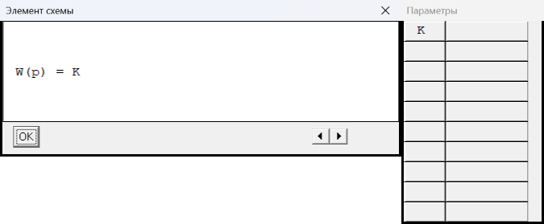
- тип 2: 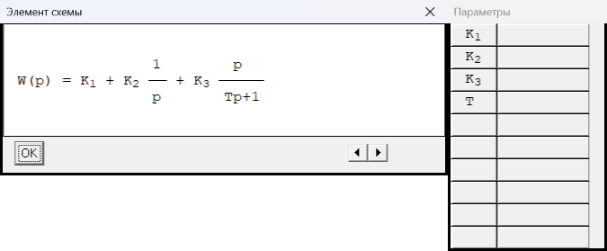
- тип 3: 
- тип 4: 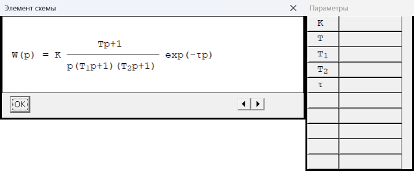
- тип 5: 
- тип 6: 
- тип 7: 
- тип 8: 
- тип 9: 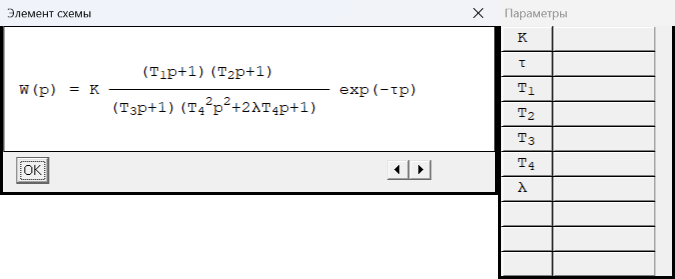
- тип 10: 
- тип 11: 
- тип 12: 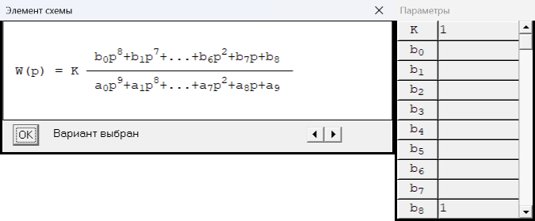

## R — 12 типов (выбран в штатном VRT: 2)
- тип 1: 
- тип 2: 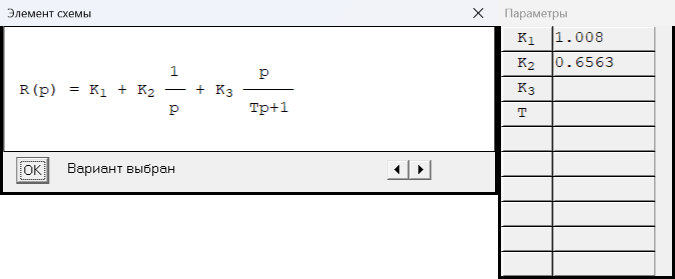
- тип 3: 
- тип 4: 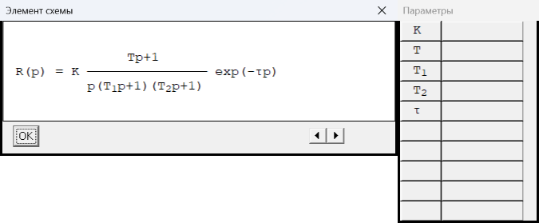
- тип 5: 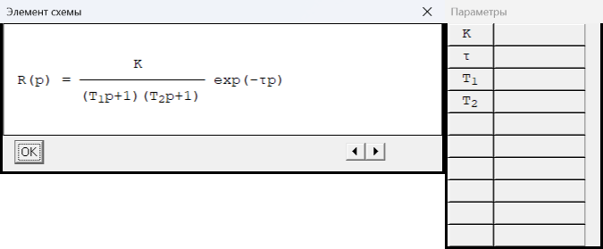
- тип 6: 
- тип 7: 
- тип 8: 
- тип 9: 
- тип 10: 
- тип 11: 
- тип 12: 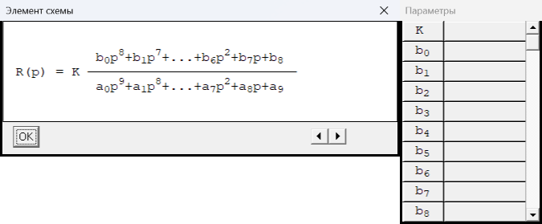

## N — 7 типов (выбран в штатном VRT: 1)
- тип 1: 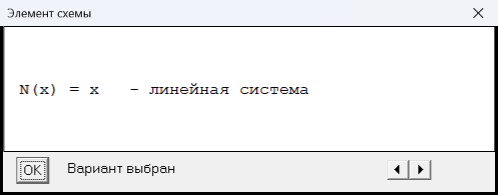
- тип 2: 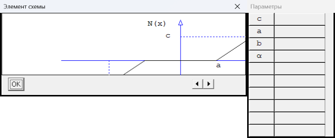
- тип 3: 
- тип 4: 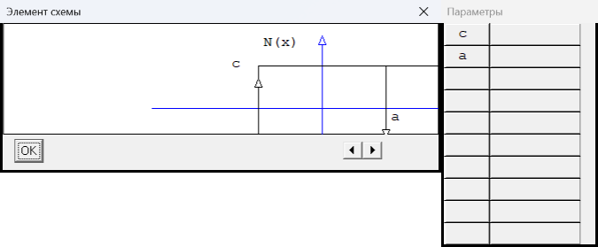
- тип 5: 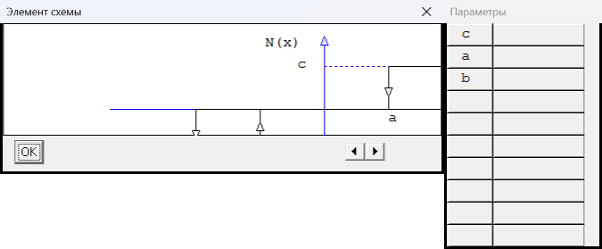
- тип 6: 
- тип 7: 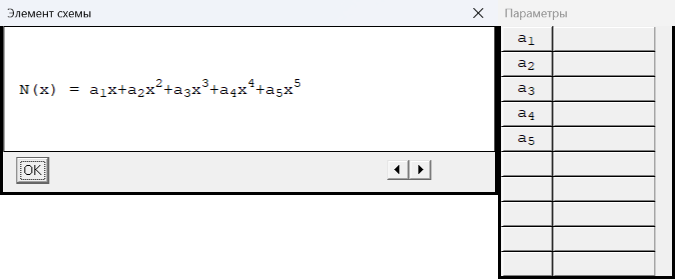

## G — 12 типов (выбран в штатном VRT: 1)
- тип 1: 
- тип 2: 
- тип 3: 
- тип 4: 
- тип 5: 
- тип 6: 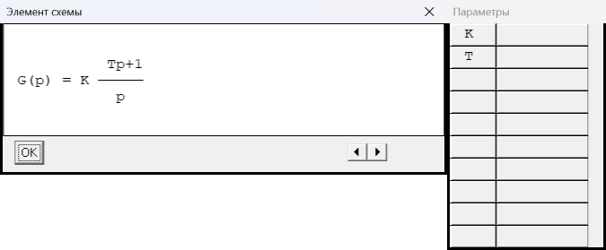
- тип 7: 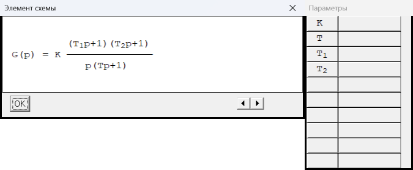
- тип 8: 
- тип 9: 
- тип 10: 
- тип 11: 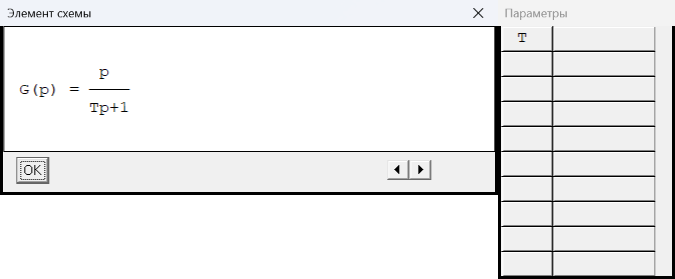
- тип 12: 

## H — 12 типов (выбран в штатном VRT: 1)
- тип 1: 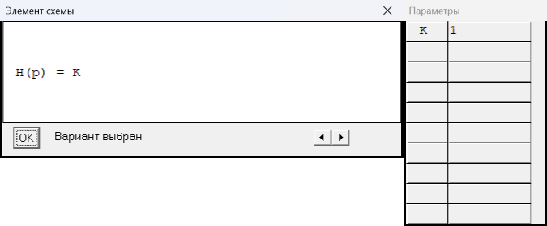
- тип 2: 
- тип 3: 
- тип 4: 
- тип 5: 
- тип 6: 
- тип 7: 
- тип 8: 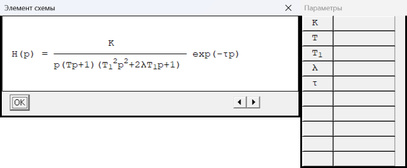
- тип 9: 
- тип 10: 
- тип 11: 
- тип 12: 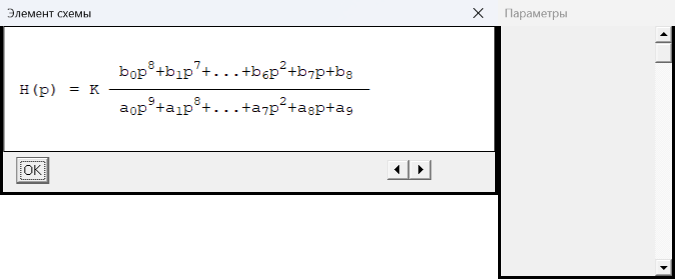

## f — 5 типов (выбран в штатном VRT: 1)
- тип 1: 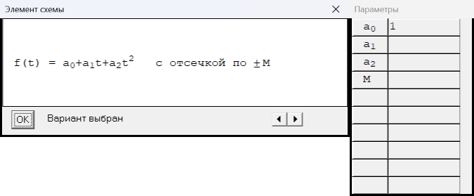
- тип 2: 
- тип 3: 
- тип 4: 
- тип 5: 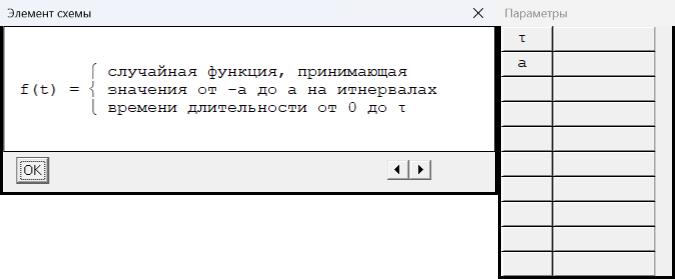

## g — 5 типов (выбран в штатном VRT: 1)
- тип 1: 
- тип 2: 
- тип 3: 
- тип 4: 
- тип 5: 

## v — 5 типов (выбран в штатном VRT: 1)
- тип 1: 
- тип 2: 
- тип 3: 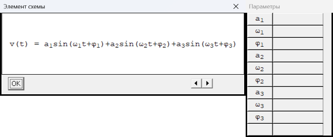
- тип 4: 
- тип 5: 

## z — 5 типов (выбран в штатном VRT: 1)
- тип 1: 
- тип 2: 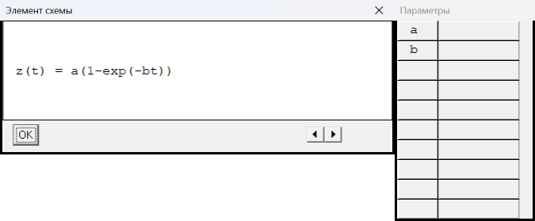
- тип 3: 
- тип 4: 
- тип 5: 

