# Библиотека звеньев IMPULS

Тип N — номер в VRT (поле после имени звена). Слева — формула/график звена, справа — окно «Параметры»
(порядок строк = порядок полей VRT).

## T — 1 типов, коды VRT 1…1 (выбран в штатном VRT: 1; коды в VRT: [1])
- тип 1: 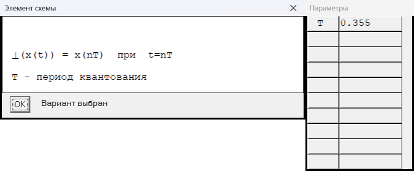

## D — 2 типов, коды VRT 1…2 (выбран в штатном VRT: 1; коды в VRT: [1])
- тип 1: 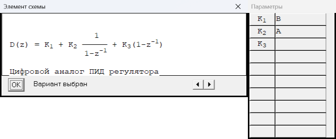
- тип 2: 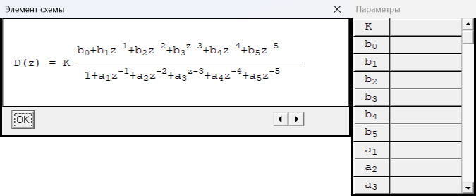

## P — 1 типов, коды VRT 1…1 (выбран в штатном VRT: 1; коды в VRT: [1])
- тип 1: 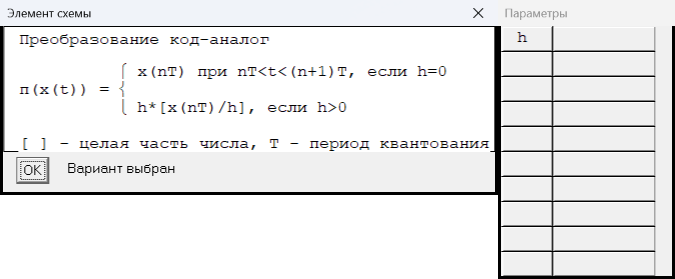

## N — 2 типов, коды VRT 1…2 (выбран в штатном VRT: 1; коды в VRT: [1])
- тип 1: 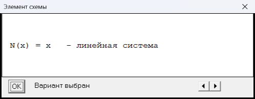
- тип 2: 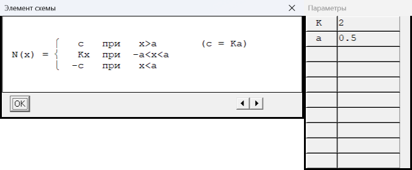

## W — 7 типов, коды VRT 1…7 (выбран в штатном VRT: 7; коды в VRT: [7])
- тип 1: 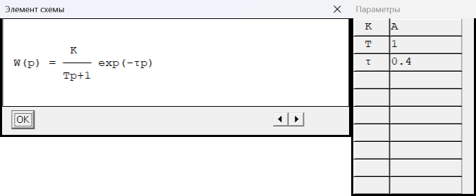
- тип 2: 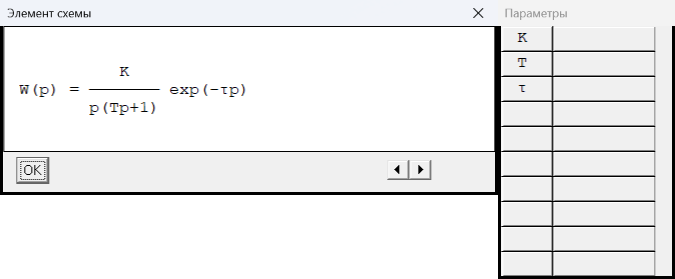
- тип 3: 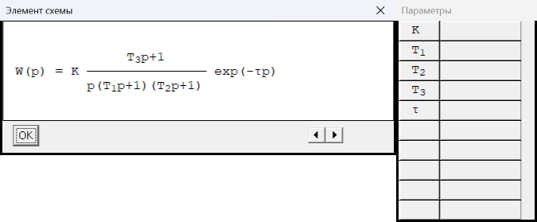
- тип 4: 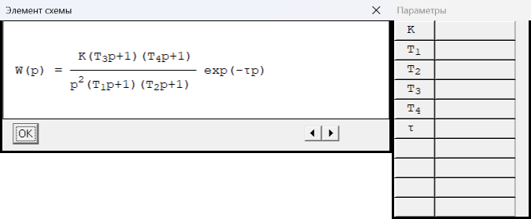
- тип 5: 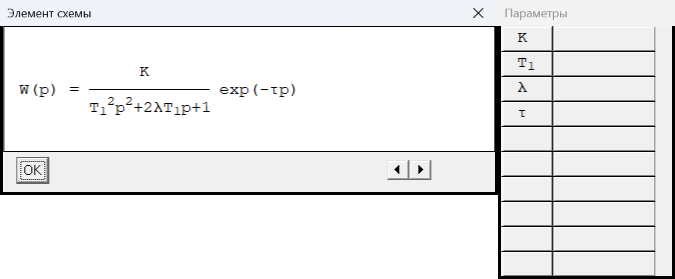
- тип 6: 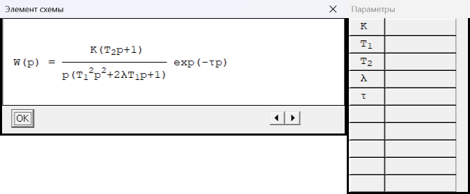
- тип 7: 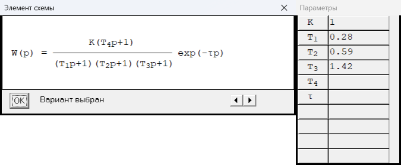

## H — 1 типов, коды VRT 1…1 (выбран в штатном VRT: 1; коды в VRT: [1])
- тип 1: 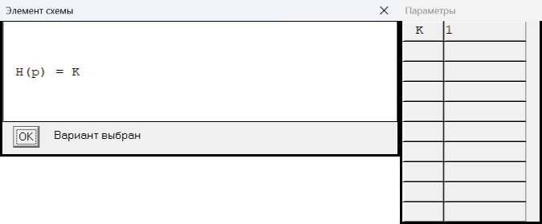

## f — 3 типов, коды VRT 1…3 (выбран в штатном VRT: 1; коды в VRT: [1])
- тип 1: 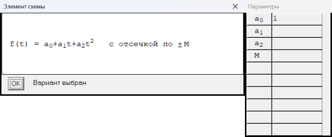
- тип 2: 
- тип 3: 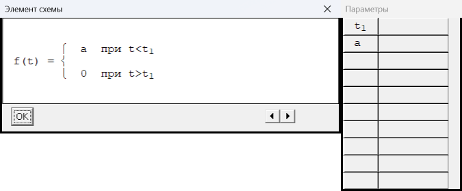

## g — 3 типов, коды VRT 1…3 (выбран в штатном VRT: 1; коды в VRT: [1])
- тип 1: 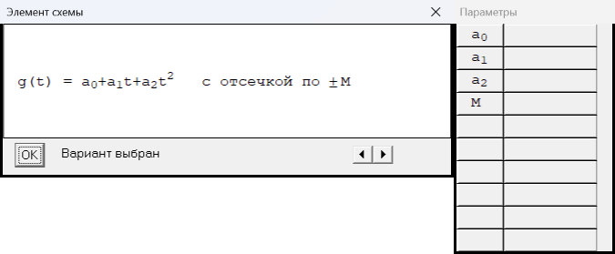
- тип 2: 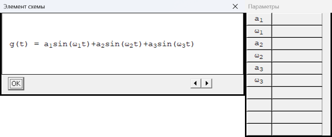
- тип 3: 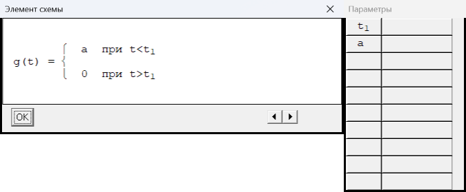

