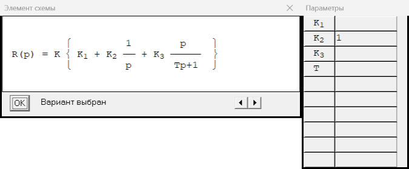
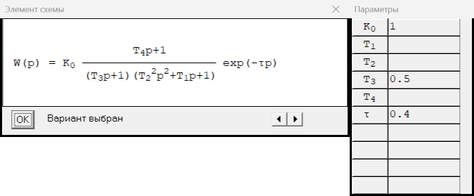
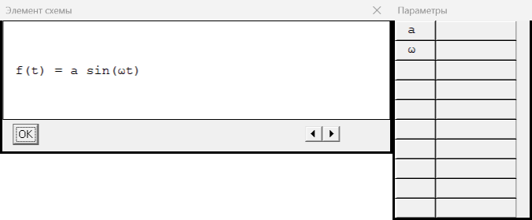
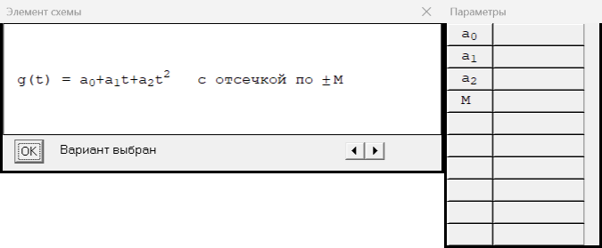
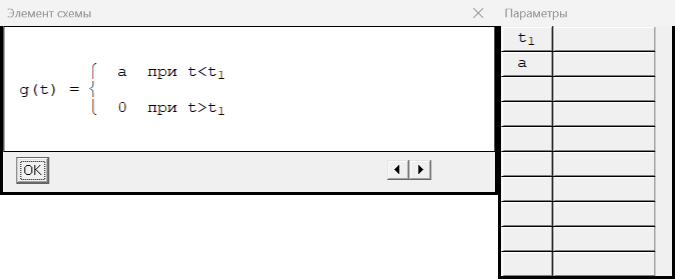

# Библиотека звеньев LINSYS2

Тип N — номер в VRT (поле после имени звена). Слева — формула/график звена, справа — окно «Параметры»
(порядок строк = порядок полей VRT).

## R — 2 типов, коды VRT 4…5 (выбран в штатном VRT: 4; коды в VRT: [4])
- тип 4: 
- тип 5: 

## W — 1 типов, коды VRT 6…6 (выбран в штатном VRT: 6; коды в VRT: [6])
- тип 6: 

## f — 3 типов, коды VRT 1…3 (выбран в штатном VRT: 1; коды в VRT: [1])
- тип 1: 
- тип 2: 
- тип 3: 

## g — 3 типов, коды VRT 1…3 (выбран в штатном VRT: 1; коды в VRT: [1])
- тип 1: 
- тип 2: 
- тип 3: 

