# Библиотека звеньев LINSYS3

Тип N — номер в VRT (поле после имени звена). Слева — формула/график звена, справа — окно «Параметры»
(порядок строк = порядок полей VRT).

## R — 2 типов, коды VRT 4…5 (выбран в штатном VRT: 4; коды в VRT: [4, 5])
- тип 4: 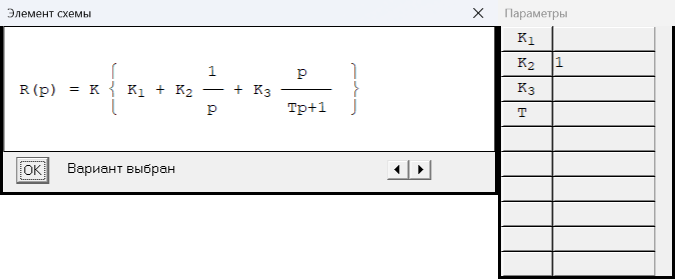
- тип 5: 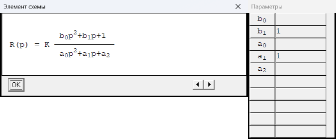

## W — 8 типов, коды VRT 6…13 (выбран в штатном VRT: 9; коды в VRT: [6, 7, 8, 9, 10, 11, 13])
- тип 6: 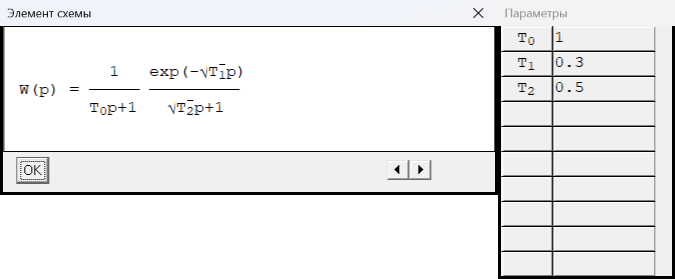
- тип 7: 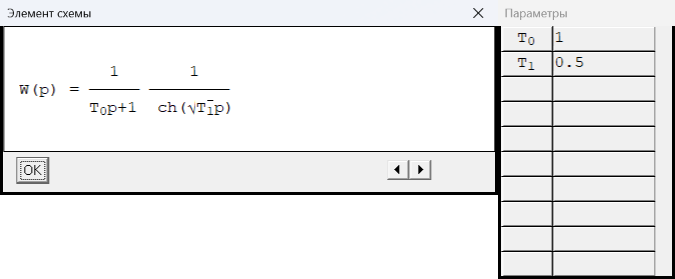
- тип 8: 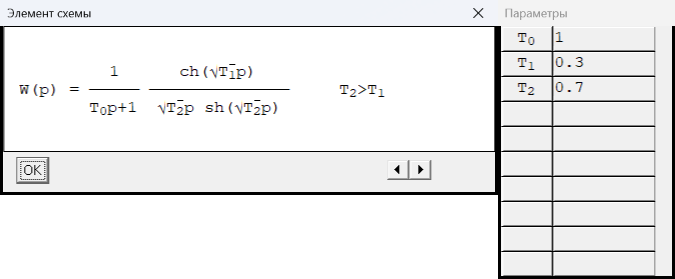
- тип 9: 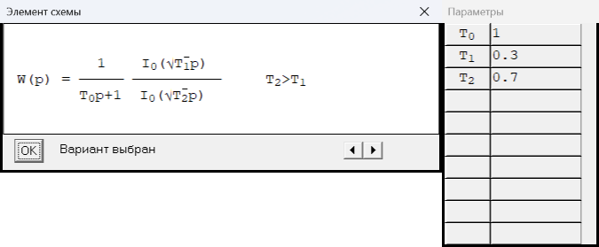
- тип 10: 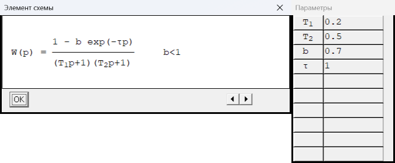
- тип 11: 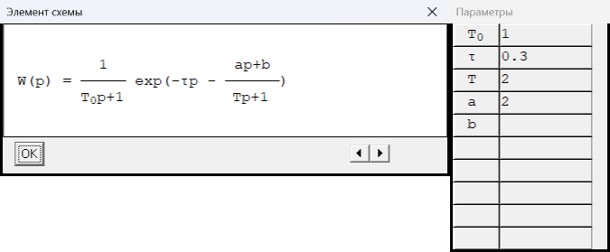
- тип 12: 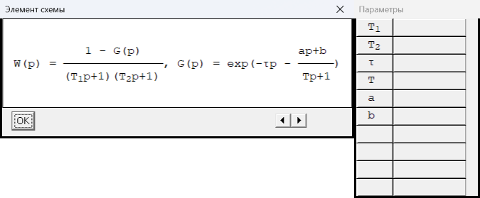
- тип 13: 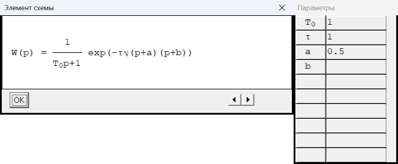

## f — 3 типов, коды VRT 1…3 (выбран в штатном VRT: 1; коды в VRT: [1])
- тип 1: 
- тип 2: 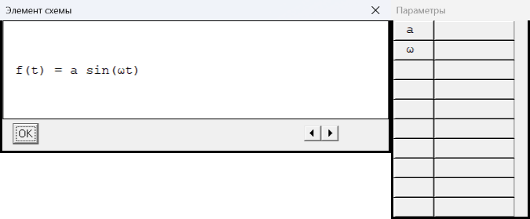
- тип 3: 

## g — 3 типов, коды VRT 1…3 (выбран в штатном VRT: 1; коды в VRT: [1])
- тип 1: 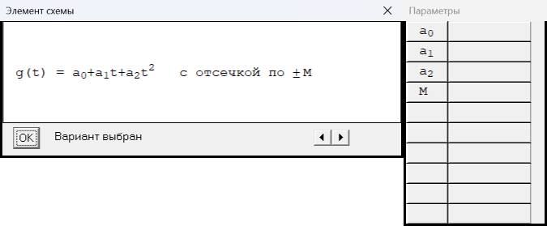
- тип 2: 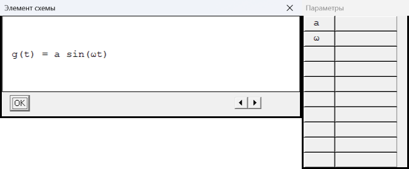
- тип 3: 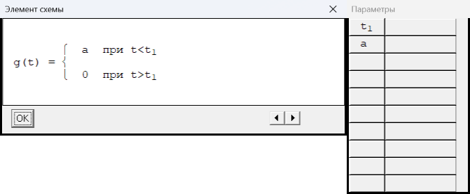

