# Библиотека звеньев NLINSYS

Тип N — номер в VRT (поле после имени звена). Слева — формула/график звена, справа — окно «Параметры»
(порядок строк = порядок полей VRT).

## N — 8 типов, коды VRT 1…8 (выбран в штатном VRT: 6; коды в VRT: [6, 8])
- тип 1: 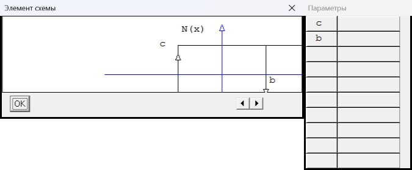
- тип 2: 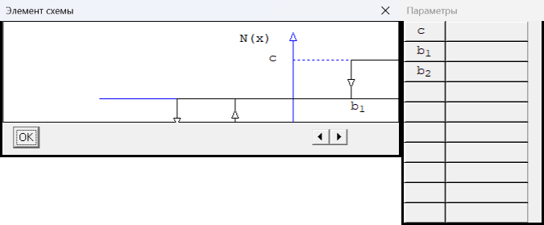
- тип 3: 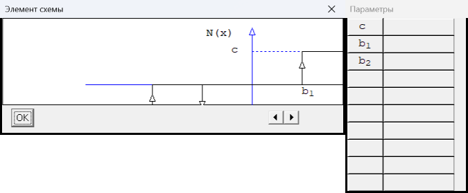
- тип 4: 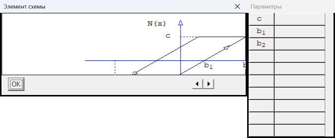
- тип 5: 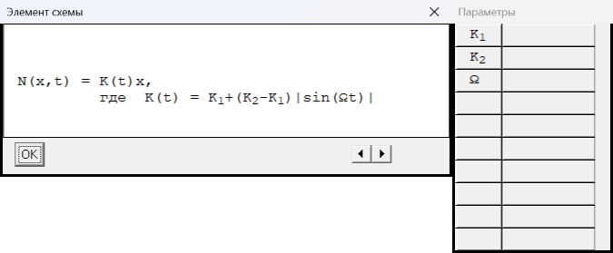
- тип 6: 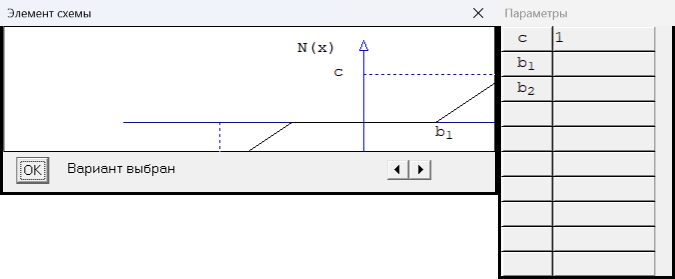
- тип 7: 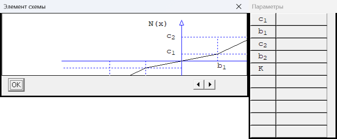
- тип 8: 

## W — 1 типов, коды VRT 1…1 (выбран в штатном VRT: 1; коды в VRT: [1])
- тип 1: 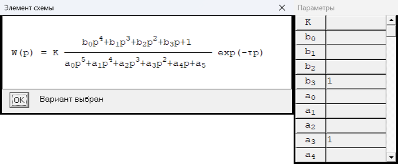

## f — 4 типов, коды VRT 1…4 (выбран в штатном VRT: 2; коды в VRT: [2])
- тип 1: 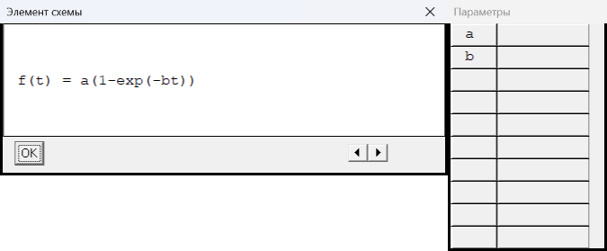
- тип 2: 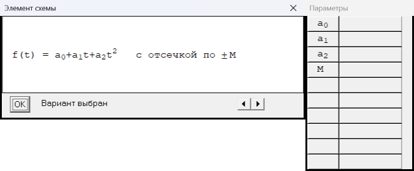
- тип 3: 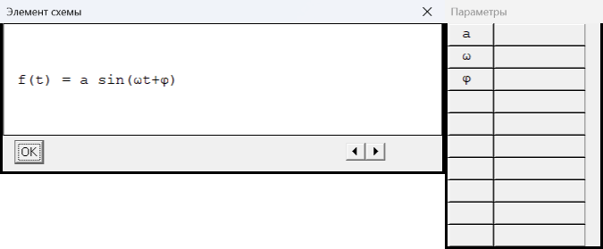
- тип 4: 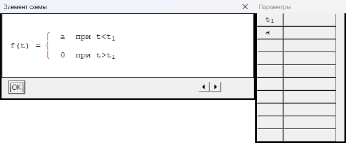

